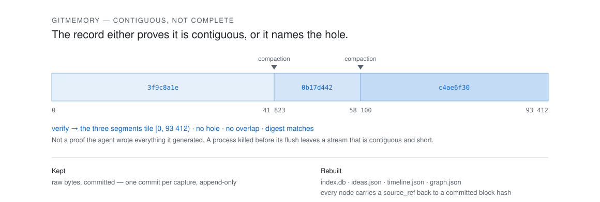

<h1 align="center">gitmemory</h1>

<p align="center"><strong>Git-versioned, contiguity-checked memory for agents that keep a local, append-only, line-delimited transcript.</strong></p>

<p align="center">
  <picture>
    <source media="(prefers-color-scheme: dark)" srcset="docs/assets/contiguity-dark.svg">
    
  </picture>
</p>

---

## The number this is built on

An agent's transcript is an append-only byte stream that nothing durably
keeps. Compaction discards it. So the case that matters is the one where the
evidence is *behind* the compaction boundary — where the live context window
has genuinely lost it.

On 470 LongMemEval instances, k = 10, seed 42, under that arrangement:

| Arm | Turn recall | Turn MRR |
|---|---|---|
| **gitmemory's index** | **0.7456** | **0.6209** |
| The live context window | 0.0000 | 0.0000 |

The zero is not a weak baseline. The bytes are gone; the window cannot reach
them at any k.

**Now the caveat, because it is the same size as the result.** Under the
*opposite* arrangement — evidence ahead of the boundary — the live window
**beats** the index, 0.7893 to 0.7456, because walling off the past also walls
off the distractors. The reported mode was pre-registered before anything was
measured, for exactly this reason. A benchmark that picked its own mode would
have published the 0.7893 as a gitmemory number.

**And the second caveat: the index above is BM25, and BM25 is the worst of the
three retrievers.** A dense arm scores 0.8215 and a reranking arm 0.8295 on the
same instances under the same mode. That does not touch the claim — it is about
the boundary, and every arm is behind it — but it does mean the default install
ships the arm that came last.
[Full gate report](docs/benchmarks/E3-longmemeval.md) — four compaction modes,
fourteen calibration gates, every arm including the ones that lost.

## What it keeps

The raw bytes, copied out at every compaction, tiled by byte offset so the
record either **proves it is contiguous or names the hole**. Everything
derived — the index, decision graphs, key ideas — is rebuilt from those bytes,
so a derivation is never the only copy of anything.

**Contiguous, not complete.** The proof is that the captured bytes tile
`[0, size)` with no hole and no overlap and hash to a recorded digest. It is
*not* a proof that the agent wrote everything it generated: a process killed
before its flush leaves a stream that is contiguous and short, and nothing on
disk can tell you about bytes that never reached the disk.

```
gitmemory watch                 # tail the configured roots, capture, commit
gitmemory capture <transcript>  # or copy out one file's new bytes, by hand
gitmemory verify                # prove the bytes tile the range they claim
gitmemory index                 # rebuild the retrieval index from the store
gitmemory recall "the question" # search it
gitmemory dashboard             # serve the index, read-only, on loopback, behind a sign-in
```

`verify` returns an empty list or a list of problems. There is no third answer.

## The measurement board

| What | How it was measured | Result |
|---|---|---|
| Retrieval across a compaction boundary | 470 LongMemEval instances, 4 compaction modes, 14 calibration gates | **0.7456** turn recall, against **0.0000** for the live window |
| Decision extraction | held-out split, gate pre-registered at precision ≥ 0.85 / recall ≥ 0.60 | **1.0000 / 0.7428** — it read 1.0000 / 1.0000 for five rounds; fix 2 spent a quarter of the recall and see below |
| The same extractor, in a vocabulary its corpus does not contain | two adversarial probes hand-written by a reviewer, both since spent | 26/32 and 27/32 — **23/32 and 25/32** once the precision fix below traded five of them away |
| The same extractor again, on two probes written blind and each scored once | 32 items apiece, in two unrelated domains chosen to share no vocabulary with the corpus or with each other | **14/32** and **14/32** — 16 and 16 after the fix their shared miss list bought, which is a floor and not a second measurement |
| The same extractor on text nobody wrote for a benchmark | a census of every distinct human turn in a third-party MIT corpus of real sessions — 140 items, labelled blind by three annotators at 139/140 agreement | **precision 0.0000, recall 0.0000**. Seven fixes later, 0.1250 / 0.5000 — one true positive, and the set is a regression floor from the first fix onward |
| …and the assistant side of the same sessions | the 61 blocks it called `reversal`, adjudicated by three more | 9 of 61 — precision 0.15. After the two fixes: **54 withdrawn, all 7 left are reversals** — and read the caveat below before quoting that |
| Hook cost in the agent's critical path | timed against spawning `true` the same way, three runs of 400 | p50 **7.4 – 7.5 ms**, p99 **10.2 – 11.5 ms** |
| The suite | on a fresh checkout, no downloads | **984 tests**, and **328 conformance cases** against three third-party corpora, one gated on the LongMemEval download and one on `pip install -e '.[serve]'` |
| Whether the tests hold anything | every fix mutated to remove the behaviour, the named test must fail | **582** negative controls |

Those two numbers do not add up, and should not: switching the corpus on
collects 1300, not 1303. Three of the conformance cases fill parametrisations
that collect as one empty placeholder each while the corpus is absent, so they
replace three of the 975 rather than joining them. The row used to read "plus",
which quietly asserted the sum.

The 328 conformance cases replay three MIT corpora — claude-code-log's fixtures
through the Claude Code adapter, pi's and oh-my-pi's through the pi adapter —
third-party, real-shaped, and not one byte of anybody's own history. They are
not in the repository, and the pi ones cannot be: every one of them carries its
author's home directory in a `cwd` field. To fetch all three at their pins:

```sh
tests/fetch_fixtures.sh          # clones into .conformance/, prints the two env vars
```

`.conformance/` is gitignored; `GITMEMORY_CC_FIXTURES` and
`GITMEMORY_PI_FIXTURES` point at clones somewhere else (the second takes a
`:`-separated list, because pi and oh-my-pi are two repositories of the same
dialect). **The count above is what a fresh checkout
collects and nothing more.** It said 1127 for two epochs, which was
true only on a machine that had already cloned the corpus — into a scratch
directory, so the test written to stop this README quoting an unreachable number
was quietly asserting one, right up until a cleanup removed `/tmp`.

**Read the extraction numbers carefully — the gap between them is the finding.**
The gate is a score on a held-out split the extractor's author could not see,
against a bar pre-registered before anything was measured. It is not evidence
the extractor reads English. It read 1.0000 / 1.0000 through five rounds of real
defects, every one of which it scored identically with and without — and then
fix 2, tightening the extractor against the real sessions two rows below, took
held-out recall to **0.7428** (257 of 346; post-failure reversals 0.5243, other
reversals 0.4595). That is a priced trade, not a gate failure: 0.7428 still
clears the 0.60 floor, and precision stayed at 1.0000 on both splits.

What is worth saying plainly is that **nobody noticed for a commit**. No test
scored `derive.decisions` against the synthetic corpus, so a quarter of the
recall went missing behind a green suite of 1168. `tests/test_decisions_bench.py`
now pins the dev split's `(matched, predicted, gold)` — the counts, not the
ratio, because `matched / predicted` reads 1.0000 while both shrink together.
The test split stays out of the suite; it is scored by hand, once per round.

Probes C and D are what that gate cannot see. Each was written by an agent that
read only this README and the design document — never the extractor, never the
other probes — in a domain chosen so that lexical overlap with the corpus is
impossible. Each was frozen unscored and scored once. **14 of 32**, against 26
and 27 for the two earlier probes, which are spent because each set the brief
for a revision and then graded it.

The 18 misses are two facts, and they point in opposite directions:

- **10 of 10 on the items that are not decisions** — no false positive anywhere
  in a vocabulary the guards have never seen, including three imperative work
  requests and two sentences carrying *must* about somebody else's rule. The
  conservatism is real and it generalises.
- **4 of 22 on the items that are.** All eleven reversals were missed, and all
  eleven were the *user* reversing their own earlier instruction — a ceiling the
  extractor declares in a source comment and nowhere a reader of these documents
  could find it. Seven of eleven directives were missed, all plain positive
  standing rules ("Patch file stays YAML.") with no prohibition to match on.

D was commissioned to ask whether that was C's domain rather than the
extractor, and the answer is no. Aviation line maintenance, an author with no
knowledge of C's theatrical show control, **and the same 14** — 10/10, 4/11,
0/11, the identical split, with the four directives that land being the same two
constructions (a prohibition, or "use X, not Y"). Two of D's reversals came back
labelled `directive`: the rule extracted is the right one and only its kind is
wrong, which is a different defect from not seeing it, and is why the shortfall
is reported as 14 rather than 16.

The extractor was **not** changed in response to either, because editing it
against a probe's own miss list turns the unspent measurement into more training
data. Full records: [C](docs/benchmarks/E5-probe-C.md),
[D](docs/benchmarks/E5-probe-D.md).

**Then it was run on text nobody wrote for a benchmark, and scored zero.**
Probes are fiction; a person asking for work at 1am does not write like a probe
author. The secondary set is every distinct human turn in four real projects
from the same third-party MIT corpus this repository already clones — a census,
not a sample, 140 items, each labelled by three annotators who worked
independently and never saw the extractor. It produced 32 `directive` nodes,
**none of them a directive**, and missed both of the two that were there.

Two things only real text could say. **A standing rule is rare** — 2 turns in
140, against a third or more in every probe, because an author asked to write
decisions writes decisions. And **two turns in five in the user role were not
typed by a user**: `<ide_opened_file>`, `<local-command-stdout>`, slash-command
wrappers. Nineteen of the thirty false positives are those, and the mechanism is
one injected sentence — *"This may or may not be related to the current task"* —
in which `_PROHIBIT` matches **`may not`**. No probe can contain this, because
every probe item is a sentence somebody wrote on purpose.

The assistant side was larger and worse: 61 distinct blocks called `reversal`, of
which three adjudicators kept **9**. The substitution frame did most of the
damage — *"pass a Path instead of a string"* is two-sided and is not a change of
course.

It was recorded first with nothing changed, against the code exactly as it stood
when the labels were written, because a number produced after the fix is a
number about the fix. **Then the first fix landed**: a block in a human's turn
that a program put there is not prose. False positives 30 → 12, machine-authored
ones 19 → 1. Precision did not move — it was 0/30 and is now 0/12, with still no
true positive — and saying it improved would be the dishonest version.

**The second fix** is the assistant side, and it rests on a definition: a
reversal is the assistant putting down *its own prior position*, not any
substitution in the artifact. Writing code is substitution all day long, so the
frame now has to be joined by evidence that something was withdrawn — a
concession, a comparative ("a different approach"), or a verdict that the thing
does not work. 52 of the 61 nodes went; 7 of the 9 left are reversals, precision
0.15 → **0.78**. It cost five items on the two spent probes, three of them the
trade itself and two collateral, and the floors were re-pinned rather than
argued with.

A review of that fix found its conjunction scoped to the whole block, which is
not a scope: both survivors were a concession opening the message and, four
hundred characters of narration later, an `instead` belonging to a description
of the bug. Scoped to the **paragraph** it withdraws those two and keeps all
seven true ones, at no cost to either gate split or to any of the four probes —
the only free correction in the round. **54 of 61 withdrawn, 7 left, none of
them known to be wrong.** Do not read that as precision 1.0000: the denominator
is the extractor's own output, so it shrinks every time the extractor gets
shyer, and an extractor that emitted nothing would score the same. The claim
that survives is the narrow one — of what it still writes, nothing is wrong —
and it rests on seven items. The set is a floor, not a generalisation measure, from fix 1
onward; what will actually settle fix 2 is a blind probe E that has not been
written yet.

Unlike a probe this set cannot be replaced by writing another one: there is one
corpus of real third-party sessions here, so from that fix onward its score is a
regression floor and nothing more. Full record:
[the secondary set](docs/benchmarks/E5-secondary-set.md).

## What is *not* measured, said on the dashboard itself

A memory system that reports only its wins is a marketing surface. These ship
as rows on the page, not as omissions:

- **Net saving versus no memory — UNMEASURED.** No "tokens saved" tile exists,
  and none will before the A/B harness runs.
- **Injection cost — NOT BUILT.** It is a *cost*, it would be shown first, and
  it does not exist yet.
- **Whether an injected memory influenced an answer — not observable.**
  Attention leaves no trace. The panel can say REFERENCED; it cannot say USED.
- **Both tails are invisible.** A prevented dead-end is an unbounded unmeasured
  saving; a stale memory that misled is an unbounded unmeasured cost. Any single
  frugality number assumes both are zero.
- **BM25/FTS5 is the weakest retriever measured, not the best.** All three
  retriever arms have now run, and the shipped default loses: 0.7456 turn
  recall against 0.8215 for `dense` (model2vec) and 0.8295 for `rerank`
  (flashrank over BM25's top 50). Both are behind the `hybrid` extra, so a
  default install gets the arm that came last.
- **The decision graph is close to useless on real sessions**, and that is
  measured rather than suspected. Precision 0.0000 on the user side — 14 nodes,
  none of them a directive — and 0.15 on the assistant side, since lifted by
  emitting 54 fewer nodes, which leaves seven and is not a precision claim. Four projects and one developer is not a
  population, and recall rests on two gold items; the false-positive count does
  not. Seven rounds of fixes later the user side emits 8 nodes and **1** of them
  is a directive — the first true positive the set has produced — which is 0.1250
  and is still close to useless.

## Getting started

Watch roots have no default. Name what to tail in
`$GITMEMORY_HOME/config.toml` (default `~/.gitmemory`):

```toml
[[watch]]
agent = "claude-code"
roots = ["~/.claude/projects"]
```

then run `gitmemory watch`. That is the whole install — see
[docs/watching.md](docs/watching.md) for the flags, the roots that get refused,
and how to tell a misconfigured watcher from an idle one.

The [hook shim](hook/README.md) is optional and makes a capture happen at the
compaction boundary rather than at the next sweep. **If you never install it
the system is still correct.** It is a POSIX `sh` script that writes stdin to a
spool and exits 0.

## What this can be pointed at

"Coding agent" was never the precondition. It is a coincidence of which
products happened to write the right kind of file. The actual requirement is
four properties, and each one is testable before a line of adapter is written:

| | | Why it is load-bearing |
|---|---|---|
| **P1** | The history is on your filesystem | Not "also synced"; on disk, where you are the data controller |
| **P2** | New events are **appended** | Earlier bytes are never rewritten. A file re-serialised whole on every turn fails this even though it is local |
| **P3** | One self-delimiting record **per line** | The store cuts a growing file into byte segments at arbitrary offsets and must be able to concatenate N of them and reparse the result. A JSON *array* cannot be cut that way. Neither can a SQLite database, or a directory of one file per event |
| **P4** | The record shape is documented, or readable from open source | Without it you still get byte-for-byte capture. You do not get an index or a derivation |

An adapter is two symbols — `AGENT` and `parse(path) -> Session` — plus
`tests/conformance.py::check_adapter`. An agent that fails **P4 only** can be
captured today with no adapter at all. An agent that fails **P2 or P3** needs a
materializer, which is a new ingestion path into the store and is not built.

### The class P1–P4 actually describes

The scope sentence every measurement here supports is not "for coding agents"
and not "for any agent". It is: **for any agent whose transcript is a local
append-only file, on a machine whose owner is the data controller.**

Nothing in the numbers is coding-specific, and that is checkable rather than
asserted: the headline result is 470 LongMemEval instances, a conversational
QA benchmark with no code in it, and the decision extractor's honest zero was
scored on human turns, not on diffs. The parser is per-line JSON; what the
lines are *about* never reaches it.

So the class is wider than the roadmap below, which is a roadmap of coding
agents only because that is where the survey looked — twenty-nine products,
all of them coding agents. Four adjacent classes look like they satisfy P1–P4,
and **none of them has been read at source, so each is a candidate and not a
claim**: on-prem enterprise agent runtimes that log to disk by policy; local
agent frameworks and SDKs that write a JSONL event log per run; ops and
robotics event logs, where append-only is the norm rather than the exception;
and support or ticketing harnesses that keep a per-conversation file. Each
needs the same four-property read the coding agents got before it belongs in a
table.

The one property that will bite outside the coding field is P3's *self-
delimiting per line*, not P1 or P2: an event log is usually append-only and
usually local, and is just as usually a rotating multi-file stream. That is a
store seam — the same one [issue #8](https://github.com/doronp/gitmemory/issues/8)
opens for Cline's single global `hooks.jsonl` — rather than a parser.

### The roadmap, and the field it is a roadmap of

Twenty-nine agents were read at source in September 2026 — the writer call, not
the blog post. The survey is not flattering to the plan this file used to
state:

- **The field is migrating away from the one format this project requires.**
  Goose still ships the JSONL reader that proves it used to write JSONL, and
  uses it only to migrate old sessions into SQLite. opencode moved off per-key
  JSON. OpenClaw's JSONL transcripts are read only by its own Doctor importer.
  Three products, one direction, one year.
- **Two of the three adapters this file used to promise are no longer
  adapters.** opencode is SQLite now. "Kimi" named a repo whose description
  today begins `[Archived]`; the successor, Kimi Code CLI, is a clean JSONL
  event log and is the retarget.
- **Compaction boundaries are getting *more* observable, not less.** Codex
  writes the post-compaction context inline next to the turns it replaces.
  Kimi Code types the boundary as `context.apply_compaction`. Gemini CLI fires
  a `PreCompress` hook before it happens. The pitch is not "we reveal a hidden
  boundary" — for these it is "we still have the bytes the boundary dropped".

| Agent | P1 | P2 | P3 | P4 | Status |
|---|---|---|---|---|---|
| Claude Code | y | y | y | y | **shipped** — `~/.claude/projects/**/*.jsonl` |
| pi / oh-my-pi (one format family, two dialects) | y | ~ | y | y | **shipped** — `~/.pi/agent/sessions/**/*.jsonl`, one adapter, `"omp"` an alias |
| Kimi Code CLI | y | y | y | y | planned — reads clean from source; no public fixtures to conform against |
| OpenAI Codex CLI | y | ~ | y | y | planned — needs a corpus, and a story for the `.jsonl.zst` a 7-day-old rollout becomes |
| Gemini CLI | y | y | y | y | planned — needs a corpus |
| DeepSeek Harness | y | y | ~ | y | planned — plain JSONL only under `compression: 'none'`; the shipped default is zstd-framed |
| Cline (`hooks.jsonl` audit stream) | y | y | y | y | planned — one global file for all sessions; the store pins one session to one path |
| Cursor Agent CLI | y | ? | y | **n** | planned — no vendor schema, two on-disk layouts, two record dialects |
| Hermes, OpenClaw, Kilo Code, opencode, Goose, Cline's own transcript, Cline's ancestor Roo Code, OpenHands, Freebuff, Continue.dev, CodeGPT | | | | | **not adaptable** — see below |

`~` means the append-only property holds with a bounded, named exception:
oh-my-pi rewrites a fixed-width 256-byte title slot at the head of a live file
(and the session manager rewrites the file whole on resume when records needed
migrating, which the adapter handles as a new generation rather than as
corruption); Codex replaces whole rollout files on a startup migration. `?` is
not a weaker `~`: nothing in Cursor's public source settles the question either
way, and the honest cell for an unread property is not a guess.

### What does not work, and why that is the useful half

- **Hermes Agent** is the largest agent on the OpenRouter board and its
  transcript is `~/.hermes/state.db`, a SQLite file whose rows are rewritten in
  place at every compaction (`UPDATE messages SET active = 0, compacted = 1`).
  It does emit a JSONL file in exactly the shape this project's Claude Code
  adapter parses — and that export mints a fresh uuid per line on every run, so
  two exports of one session never agree on a single id.
- **Cline** rewrites its whole transcript with `writeFileSync` on every agent
  loop *iteration* — not every turn — and the key that changes sits about
  thirty bytes into the file, so there is no stable prefix at all. It is the
  cleanest citable instance of a P2 failure: local, open source, and
  unadaptable.
- **Continue.dev** is local, human-readable, Apache-2.0, and re-serialises the
  whole session on every save. It is the proof that "local" and "append-only"
  are two requirements and not one stated twice.
- **Aider** writes its history *into the git working tree*, which is the
  closest anything in the field comes to this project's own premise — and it
  prefixes every user line with `#### ` while writing assistant output with no
  prefix at all, so an assistant reply containing a heading is byte-identical
  to a user turn.
- **Amp** fails one level above format: the thread of record lives on the
  vendor's servers. There is nothing to reverse-engineer, because the user is
  not the data controller of their own history.

A capture of an agent in that list is still possible — the bytes copy — but it
would be a snapshot-and-commit, and this project's whole claim is the thing a
snapshot cannot make: that nothing was elided between one commit and the next.

## If a credential lands in the store

It will. A transcript is a recording of a terminal, and terminals print tokens.
The design answer is that `raw/` stays on your machine and the gate stands at
`push`; the operational answer is shorter:

1. **Rotate the credential.** Do this first and do not wait for anything below.
   The store is append-only and local, so the blob is in your history whatever
   you do next, and a rotated key is worth nothing to anyone holding it.
2. **`gitmemory push` will refuse, and that is working.** It scans the files git
   would ship, the segment seams, *and* the object graph a push transmits —
   deleting the file does not make the push clean, because `git push` does not
   send the working tree.
3. **If you must un-say it,** the store is an ordinary git repository, so the
   ordinary history-rewriting tools apply — `git filter-repo` is the usual one,
   and it is not vendored here. Run `gitmemory verify` afterwards: it will tell
   you whether the segments still tile. This is not automated and will not be —
   a memory system that silently edits its own history is not one you can quote
   from.

There is no override flag. A gate you can wave through on a deadline is a gate
that gets waved through on a deadline.

## Status

Under construction, epoch by epoch.

| | | |
|---|---|---|
| E1 | Canonical records + Claude Code adapter | passed |
| E2 | Segment store, contiguity proof, `verify`, redaction gate | passed |
| E3 | Index + retrieval + CLI | passed — [gate report](docs/benchmarks/E3-longmemeval.md) |
| E4 | Hook shim + watcher + git daemon | in review |
| E5 | Derivation and decision graph | passed — [gate report](docs/benchmarks/E5-decision-gate.md); three artifacts per generation. Reopened by [probe C](docs/benchmarks/E5-probe-C.md) and held open by [probe D](docs/benchmarks/E5-probe-D.md), which replicates it in an unrelated domain: user-reverses-own-instruction is 0 of 11, twice. Then [the secondary set](docs/benchmarks/E5-secondary-set.md) scored it on real third-party sessions: **precision 0.0000 / recall 0.0000** on 140 human turns, 9 of 61 on the assistant side. Two fixes since: machine-injected blocks out of the prose stream, and the assistant substitution frame now needs a withdrawal beside it, in the same paragraph — 54 of the 61 withdrawn, the 7 left all reversals, user side unmoved |
| E6 | Dashboard | passed — seven views over the index, served read-only on loopback, [review record](docs/reviews/E6-standalone-review.md) |
| E7 | RC1: security review, private repo | review closed — six surfaces, 68 findings, [round record](docs/reviews/E7-security-round.md); the fixes then reviewed twice over, [pair review](docs/reviews/E7-pair-review.md); every row of the control index run, and the seven it broke on fixed. Apache-2.0, private repository, pushed |
| E7b | The delta that review did not read | 4,966 lines landed after it, so four more lenses plus a pair review read the difference: 22 findings, 19 changed, 3 accepted with the measurement written down — [round record](docs/reviews/E7b-security-delta.md). Four High, one per lens, which is the argument for running four. The worst was a regex that could match one span two ways: 200 bytes in a transcript disabled `derive` for that store permanently |

## How this is built

Every module gets a standalone review round by an agent that did not write it,
in its own worktree, and every finding is re-derived by a route the reviewer did
not use before it is accepted — because a reviewer who is right for the wrong
reason is still being graded. Seven of the last round's tests were refuted that
way and rewritten: three the reviewer caught, four found while writing the tests
that answer them.

`docs/DESIGN.md` holds the locked decisions. `docs/reviews/` holds the record,
including the findings that were disputed and why, and the ones whose
demonstration was wrong while their conclusion held.

## Licence

Apache-2.0. Third-party code and its licences are listed in `THIRD_PARTY.md`.
