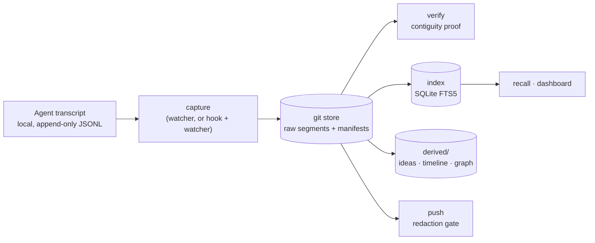

<p align="center">
  <picture>
    <source media="(prefers-color-scheme: dark)" srcset="docs/assets/logo-dark.svg">
    
  </picture>
</p>

<p align="center"><strong>Memory for AI agents: what your agent loses at compaction, kept byte for byte, provably, on your own machine.</strong></p>

<p align="center"></p>

<p align="center">
  <a href="LICENSE"></a>
  <a href="pyproject.toml"></a>
  <a href="https://github.com/doronp/gitmemory/actions/workflows/ci.yml"></a>
  <a href="https://scorecard.dev/viewer/?uri=github.com/doronp/gitmemory"></a>
  
  
</p>

<p align="center">
  <a href="#quickstart">Quickstart</a> ·
  <a href="#results">Results</a> ·
  <a href="#how-it-works">How it works</a> ·
  <a href="docs/README.md">Docs</a> ·
  <a href="CONTRIBUTING.md">Contributing</a>
</p>

---

When an agent compacts its context, everything behind the boundary drops out of
the window. gitmemory copies each new byte of the transcript into a local git
repository before that happens, proves the copy has no holes, and makes it
searchable. It has no LLM, makes no network calls, and its core has no
dependencies.

## Why gitmemory

- **It recovers what compaction drops.** On 470 LongMemEval instances whose
  evidence sits behind the compaction boundary, turn recall is **0.7456**. The
  live context window scores **0.0000**, because those bytes are gone from it.
- **It proves its own record.** The captured segments tile the transcript's byte
  range with no hole and no overlap, and they hash to a recorded digest.
  `gitmemory verify` prints either an empty list or the problems it found.
- **Its retrieval is competitive without an LLM.** With a local cross-encoder
  over the index, it ranks **1st** among no-LLM retrievers on LongMemEval-S
  session R@5 (**99.2**) and R@10 (**99.8**). It is 2nd on all-evidence@10 and
  on LoCoMo.
- **It is private by construction.** Your history stays on your disk, in
  plain git. The only way anything leaves is `push`, behind a redaction gate
  that has no override flag.
- **Its numbers are honest.** Every result below is published with the arms
  that lost, including the benchmarks where gitmemory comes last.

## Quickstart

Requires Python 3.13+ and git.

```sh
uv tool install git+https://github.com/doronp/gitmemory     # or: pipx install git+https://…
```

Tell it what to watch. Watch roots have no default, and the config lives in
`$GITMEMORY_HOME/config.toml` (by default `~/.gitmemory`):

```toml
[[watch]]
agent = "claude-code"
roots = ["~/.claude/projects"]
```

Then:

```sh
gitmemory watch                  # tail the roots, capture what grew, commit
gitmemory verify                 # prove the bytes tile the range they claim
gitmemory index                  # build the search index from the store
gitmemory recall "why did we drop the retry loop?"
```

That is the whole install. The optional [hook shim](hook/README.md) makes a
capture happen exactly at the compaction boundary instead of at the next sweep;
**without it the system is still correct.** For watcher flags and
troubleshooting, see [docs/watching.md](docs/watching.md).

**What to do with it next** — reading `recall` output, handing it back to an
agent after compaction, derived key ideas, the dashboard — is in
[docs/USAGE.md](docs/USAGE.md).

| Command | What it does |
|---|---|
| `gitmemory watch` | Tails the configured roots, captures what grew, and commits |
| `gitmemory capture <file>` | Copies out one transcript's new bytes, by hand |
| `gitmemory verify` | Checks every manifest's contiguity proof |
| `gitmemory index` | Rebuilds the SQLite FTS5 index from the store |
| `gitmemory recall "<query>"` | Searches the index and prints one line per turn, best first |
| `gitmemory derive [--graph]` | Rebuilds key ideas and a timeline; `--graph` adds the decision graph (opt-in) |
| `gitmemory dashboard` | Serves the index with Datasette, read-only, on loopback, behind a sign-in |
| `gitmemory push` | Runs the redaction gate over what a push would send (it does not send yet) |

Optional extras: `hybrid` (what the benchmarks' dense and rerank arms need;
`recall` does not use them), `derive` (key ideas and the graph), and
`serve` (the dashboard). Example:
`uv tool install "gitmemory[serve] @ git+https://github.com/doronp/gitmemory"`.

## Results

These are all of the published results, wins and losses together. Each row links
to the report it comes from; [docs/RESULTS.md](docs/RESULTS.md) is the full
narrative, and [docs/REPRODUCE.md](docs/REPRODUCE.md) gives the command behind
each number and how closely a rerun should match.

**Recovering evidence behind the compaction boundary** ([E3](docs/benchmarks/E3-longmemeval.md): 470 LongMemEval instances, k = 10, seed 42, 4 compaction modes, 14 calibration gates)

| Arm | Turn recall | Note |
|---|---|---|
| Live context window | 0.0000 | The bytes are gone; no k can reach them |
| **gitmemory, shipped (BM25)** | **0.7456** | Turn MRR 0.6209 |
| gitmemory, `dense` bench arm (model2vec) | 0.8215 | `hybrid` extra |
| gitmemory, `rerank` bench arm (BM25 top 50, reranked) | 0.8295 | `hybrid` extra |
| *Opposite arrangement: evidence ahead of the boundary* | *live window 0.7893 beats the index's 0.7456* | Walling off the past also walls off the distractors. The reported mode was pre-registered |

**Against open-source memory products, under their own protocols** ([E9](docs/benchmarks/E9-peer-protocols.md)). The peers are systems with an OSI-licensed engine in a public repository. Every row is a self-report, ours included, and every peer figure links to its source in E9.

*Retrieval, no LLM in the loop.* The open-source systems that publish these are MemPalace and agentmemory.

| Benchmark (metric) | gitmemory | MemPalace | agentmemory | Shipped BM25 alone |
|---|---|---|---|---|
| LongMemEval-S, session R@5 | **99.2** | 98.4 (450 held-out) | 95.2 | 95.8 |
| LongMemEval-S, session R@10 | **99.8** | **99.8** (450 held-out) | 98.6 | 97.2 |
| LongMemEval-S, all-evidence@10 | **96.0** | not published | not published | 86.4 |
| LoCoMo, session R@10 | 91.3 | **92.4** | not published | 86.5 |

*End-to-end QA accuracy (reader + judge).* Each system uses its own reader and judge, so ranks are approximate.

| System | LongMemEval-S | LoCoMo cats 1–4 |
|---|---|---|
| Mastra Observational Memory | **94.87** | not published |
| Mem0 (Platform) | 94.8 | 92.5 |
| Hindsight | 94.6 | 92.01 |
| **gitmemory** | 94.2 (4th of 8) | 85.5 (7th of 9) |
| Honcho | 92.6 | 89.9 |
| Zep (engine open as Graphiti) | 90.2 | **94.7** |
| MemOS | 89.2 | 88.83 |
| EverOS (EverMemOS) | 83.0 | 93.05 |
| Memobase | not published | 75.78 |
| Letta | not published | 74.0 |

Closed or source-available systems that publish only their own numbers (Total
Recall, Recallium, Backboard, ByteRover) are listed at the end of E9 and not
ranked against. Total Recall reports the highest QA figure anyone publishes,
98.0 on LongMemEval-S, with no public artifact behind it.

The gitmemory column is the `rerank12` bench arm: BM25 retrieves 200 turns and a
local MiniLM-L-12 cross-encoder reorders them. The exception is LoCoMo QA,
which used the `rerank` arm. `rerank12` was chosen on the LoCoMo dev half and
run unchanged everywhere else. **The product ships BM25 alone, which is first
on nothing.** The QA rows use Gemini 3.1 Pro as reader and judge, which is not
any leaderboard's judge. Mastra's 94.87 is a mean of per-type scores; pooled as
ours is, it reads 93.6.

**On E3's harness** ([E8](docs/benchmarks/E8-where-we-stand.md)): the shipped
arm reads session Hit@10 **0.9660**, All@10 **0.8298**. Against agentmemory,
which runs the identical dataset file, it beats agentmemory's BM25 configuration
(0.9460) and trails its hybrid configuration (0.9860).

**Decision extraction** (opt-in, `derive --graph`). It is close to useless on
real text, and that is a measurement rather than a suspicion.

| Test | Result |
|---|---|
| Held-out gate, pre-registered at precision ≥ 0.85 / recall ≥ 0.60 ([E5](docs/benchmarks/E5-decision-gate.md)) | **1.0000 / 0.7428**, passed |
| Blind probes, each scored once, in vocabularies the corpus lacks ([C](docs/benchmarks/E5-probe-C.md), [D](docs/benchmarks/E5-probe-D.md), [E](docs/benchmarks/E5-probe-E.md)) | 14/32, 14/32, 19/32. No false positive on any non-decision; a user reversing their own instruction is 0 of 11, twice |
| Real third-party sessions, 140 human turns labelled blind ([secondary set](docs/benchmarks/E5-secondary-set.md)) | Precision **0.0000**, recall **0.0000** at first. After seven fixes: 0.1250 / 0.5000, one true positive |
| The same sessions, assistant side | 9 of 61 nodes were real reversals (precision 0.15). After two fixes, 7 nodes are left and all 7 are reversals. That is not a precision claim: the denominator shrank |

**Engineering**

| What | How it was measured | Result |
|---|---|---|
| Hook cost in the agent's critical path | Timed against spawning `true` the same way, three runs of 400 | p50 **7.4 – 7.5 ms**, p99 **10.2 – 11.5 ms** |
| The suite | On a fresh checkout, no downloads | **1,025 tests**, and **328 conformance cases** against three third-party corpora, one gated on the LongMemEval download and one on `pip install -e '.[serve]'` |
| Whether the tests hold anything | Every fix mutated to remove its behaviour; the named test must fail | **606** negative controls |

The two suite counts do not add up, and should not. Switching the corpora on
collects 1350, not 1353. Three conformance cases fill parametrisations that
collect as one empty placeholder each while the corpora are absent, so they
replace three of the 1025 rather than joining them. Every figure on this board
is pinned by a test, which is how it stays true.

**What is not measured**, and is shown as a row on the dashboard rather than
left out:

- **Net saving versus no memory: unmeasured.** No "tokens saved" figure exists,
  and none will until an A/B harness does.
- **Injection cost: not built.**
- **Whether an injected memory influenced an answer: not observable.** The
  dashboard can say REFERENCED; it cannot say USED.
- **Both tails are invisible.** A dead end that memory prevented, and a stale
  memory that misled, are both unmeasured, and a single frugality number
  assumes both are zero.

## How it works

<p align="center">
  <picture>
    <source media="(prefers-color-scheme: dark)" srcset="docs/assets/contiguity-dark.svg">
    
  </picture>
</p>



1. **Capture.** The watcher tails each transcript by path, inode and offset,
   and copies out only the bytes appended since the last capture. They are
   stored as segments named by their byte range. If the source is ever
   rewritten, capture starts a new *generation* instead of reporting
   corruption.
2. **Prove.** Each generation's manifest records the canonical parse and a
   proof that the segments tile `[0, size)` and hash to a recorded digest. The
   store is an ordinary git repository, so a stranger with a clone can run
   `verify` and check it.
3. **Derive.** The search index, key ideas and the decision graph are rebuilt
   from the committed bytes and are never the only copy of anything. The same
   bytes always give the same output, so `git diff` on `derived/` shows what
   changed.

**Contiguous, not complete.** The proof is that the captured bytes have no hole
and no overlap. It is *not* a proof that the agent wrote everything it
generated: a process killed before it flushes leaves a stream that is contiguous
and short, and nothing on disk can reveal bytes that never reached the disk.

Components, the on-disk layout and the trust boundaries are covered in
[docs/ARCHITECTURE.md](docs/ARCHITECTURE.md). The locked decisions and the
reviews behind them are in [docs/DESIGN.md](docs/DESIGN.md).

## Supported agents

gitmemory works with any agent whose history is a **local, append-only file
with one self-delimiting record per line**. Coding agents are simply the ones
that happen to write such files.

| Agent | Status |
|---|---|
| Claude Code | **shipped** |
| pi / oh-my-pi | **shipped**, one adapter for two dialects |
| Kimi Code CLI, OpenAI Codex CLI, Gemini CLI, DeepSeek Harness, Cline (`hooks.jsonl`), Cursor Agent CLI | planned |
| Hermes, OpenClaw, opencode, Goose, Cline's transcript, Continue.dev, Aider, Amp, and others | not supported yet: each rewrites history in place, keeps it in SQLite or on a server, or writes records that are hard to tell apart. Most could be supported through a materializer (not built), an export the agent already has, or a small upstream change |

The four properties, a survey of twenty-nine agents read at source, and what
each of the rest would need: [docs/agents.md](docs/agents.md).

## Documentation

- [Documentation index](docs/README.md)
- [Architecture](docs/ARCHITECTURE.md) · [Design](docs/DESIGN.md) · [Results](docs/RESULTS.md)
- [Watching](docs/watching.md) · [Hook shim](hook/README.md) · [Agents](docs/agents.md)
- [Roadmap](ROADMAP.md) · [Changelog](CHANGELOG.md)

## Community

- **Questions and ideas:** [Discussions](https://github.com/doronp/gitmemory/discussions). **Bugs:** [issues](https://github.com/doronp/gitmemory/issues). See [SUPPORT.md](SUPPORT.md).
- **Contributing:** start with [CONTRIBUTING.md](CONTRIBUTING.md). Commits are signed off under the [DCO](https://developercertificate.org/).
- **Security:** report privately; see [SECURITY.md](SECURITY.md), which also covers
  [what to do when a credential lands in the store](SECURITY.md#if-a-credential-lands-in-the-store).
- **Governance:** [GOVERNANCE.md](GOVERNANCE.md) · [MAINTAINERS.md](MAINTAINERS.md) · [Code of Conduct](CODE_OF_CONDUCT.md)

## License

gitmemory is licensed under the [Apache License, Version 2.0](LICENSE).
Vendored third-party code and its MIT licences are listed in
[THIRD_PARTY.md](THIRD_PARTY.md) and [NOTICE](NOTICE). Benchmark datasets are
downloaded at run time from their publishers and are never redistributed here.
