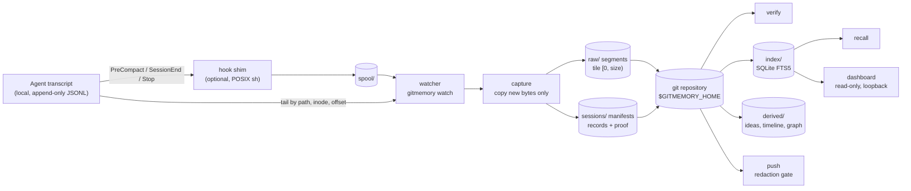

# Architecture

This page gives the shape of the system in about five minutes. The locked
decisions, and the review history behind each of them, are in
[DESIGN.md](DESIGN.md); section numbers below point into it.

## The idea

Most agent-memory tools distil a conversation first and store the result. When
that result is wrong you cannot tell, because the source is gone. gitmemory
versions the **source** instead: the transcript's own bytes, as append-only
segments in a git repository. Everything derived (the search index, key ideas,
the decision graph) is a rebuildable function of those committed bytes.

It rests on two properties:

1. **Contiguous.** The captured segments tile `[0, size)` of the transcript with
   no hole and no overlap, and they hash to a recorded digest. `verify` checks
   this and prints either an empty list or the problems it found.
   *Contiguous is not complete:* a process killed before it flushes leaves a
   stream that is contiguous and short. §2.5.
2. **Deterministic.** The same committed bytes always produce byte-identical
   derived artifacts, so `git diff` on `derived/` shows what changed in the
   record. There is no LLM anywhere in the product. §2.6.

## Data flow



Only the path from transcript to git is a source of truth. Everything to the
right of `git` can be deleted and rebuilt, so `index/` is gitignored and
`derived/` is regenerated by `derive`.

## Components

| Layer | Module | What it does | Design |
|---|---|---|---|
| Trigger | [`hook/gitmemory-hook.sh`](../hook/gitmemory-hook.sh) | Writes the hook's stdin to one spool file and exits 0. No git, no Python, no network. It adds latency, not correctness | §2.3 |
| Trigger | [`daemon.py`](../src/gitmemory/daemon.py) | The watcher. It tails the configured roots by `(path, inode, offset, mtime)`, drains the spool, captures and commits. This is what makes capture a guarantee | §2.3 |
| Parse | [`adapters/`](../src/gitmemory/adapters/) | Turns agent-native bytes into canonical records. An adapter is two symbols, `AGENT` and `parse(path)`, and it may not touch git, the index or derivation | §2.1–2.2 |
| Parse | [`records.py`](../src/gitmemory/records.py) | Canonical `Session` / `Turn` / `Block` / `Event`, with content-derived IDs and sorted-key JSON, so the committed tree stays diffable | §2.1 |
| Parse | [`jsonl.py`](../src/gitmemory/jsonl.py) | A streaming JSONL reader with exact byte offsets, vendored from fable (MIT) | §2.5b |
| Store | [`store.py`](../src/gitmemory/store.py) | Append-only segments, generations and the contiguity proof, plus `verify`. It never writes to the source transcript | §2.4–2.5a |
| Store | [`gitrepo.py`](../src/gitmemory/gitrepo.py) | The only module that runs git, always as `git -C <home>` | §2.4 |
| Derive | [`index.py`](../src/gitmemory/index.py) | A SQLite FTS5 (BM25) index rebuilt from raw bytes. It is never authoritative | §2.7 |
| Derive | [`derive.py`](../src/gitmemory/derive.py), [`graph.py`](../src/gitmemory/graph.py) | Key ideas and a timeline. The decision extraction behind the graph is opt-in (`--graph`) | §2.6 |
| Surface | [`__main__.py`](../src/gitmemory/__main__.py) | The CLI: `capture watch verify push index derive dashboard recall` | §2.8 |
| Surface | [`dashboard.py`](../src/gitmemory/dashboard.py) | Datasette over the index, `--immutable`, on loopback, behind a single-use sign-in URL | §2.9 |
| Egress | [`redact.py`](../src/gitmemory/redact.py) | The only place secrets are looked for. It stands at `push` and scans the files, the segment seams and the object graph a push would transmit | §2.4 |

## On disk

```
$GITMEMORY_HOME/                      # default ~/.gitmemory; a git repository
  raw/<agent>/<session_id>/g<NN>/
      000000000000-000000131072.jsonl     # bytes [0, 131072) of generation NN
      000000131072-000000164000.jsonl     # bytes [131072, 164000)
  sessions/<agent>/<session_id>/
      g00.json                             # canonical records + contiguity proof
      g01.json                             # written only when the source diverges
  derived/<agent>/<session_id>/g<NN>/     # rebuilt by `derive`
  index/                                   # gitignored: SQLite is not diffable
  spool/                                   # gitignored: one file per hook fire
  .locks/                                  # gitignored: one per session
  config.toml                              # watch roots; there is no default
```

A capture commits **only the bytes appended since the last recorded offset**,
so the store holds each byte the agent wrote exactly once. If the source is
rewritten (its prefix no longer matches), capture starts a new *generation*
`g<NN+1>` rather than treating the rewrite as corruption. §2.5a.

## Trust boundaries

- **Input is untrusted.** A transcript is whatever bytes an agent wrote.
  Sources are opened with `O_NOFOLLOW | O_NONBLOCK` and refused unless they
  are regular files. Every superlinear cost the reviews found in parsing has
  been fixed and measured. `verify` reports a symlink that moves bytes out of
  the store rather than walking through it. The E7
  [filesystem review](reviews/E7-security-fs.md) records each case.
- **Nothing leaves the machine by default.** There is no network call in the
  product, no LLM and no remote configured. `push` is the only egress path,
  and its redaction gate has no override flag.
- **The dashboard is not a boundary you can forget about.** Loopback has no uid
  check and is reachable by DNS rebinding. So the dashboard denies anonymous
  access and prints a single-use sign-in URL whose cookie is scoped to the host.
- **Hooks are best-effort.** The shim always exits 0 and can be removed at any
  time; the watcher alone is enough for correctness.

## What is deliberately not here

- **An LLM in the automatic path.** Derivation is deterministic by
  construction. The QA harness in `bench/qa.py` calls a model to *evaluate*
  retrieval and is never imported by the product.
- **Its own web UI.** Datasette already does that job.
- **Its own graph engine.** graphify owns the graph; gitmemory supplies the
  claims. §2.6.
- **Automated history rewriting.** A memory you can quote from does not
  silently edit itself. See [SECURITY.md](../SECURITY.md#if-a-credential-lands-in-the-store).
